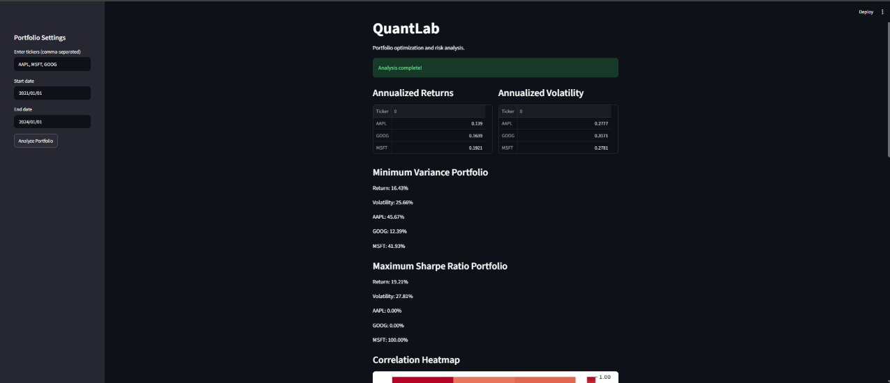
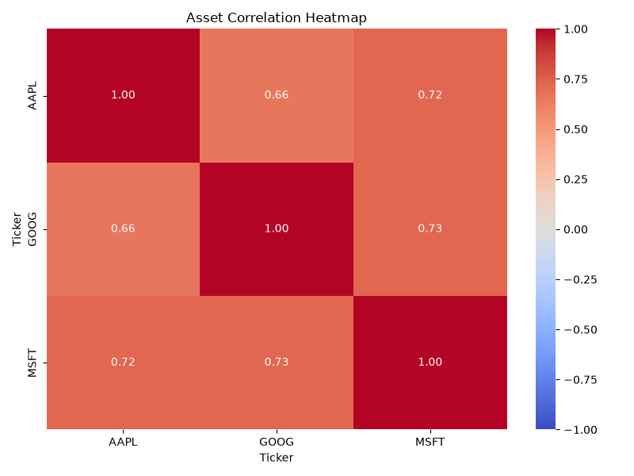
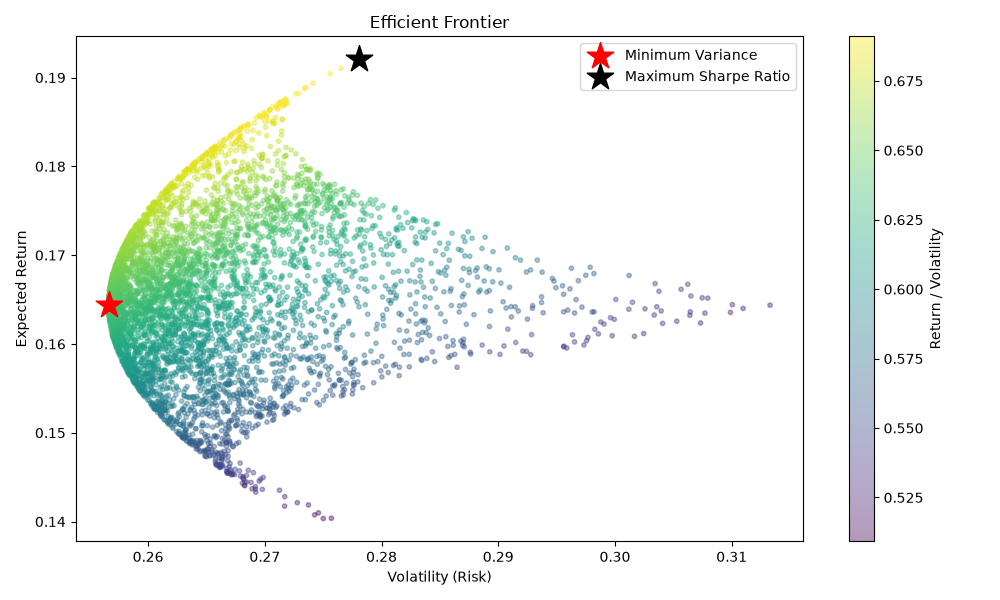
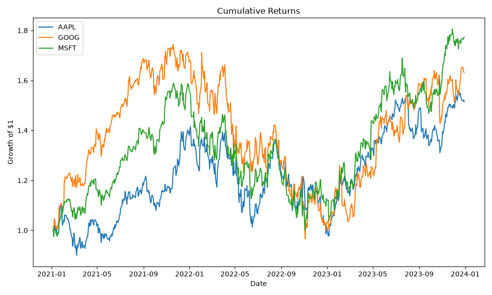

# QuantLab

**A quantitative portfolio optimization and risk analysis platform, built from scratch in Python.**

QuantLab fetches real historical market data, calculates risk and return metrics, applies Modern Portfolio Theory to find mathematically optimal portfolios, and presents everything through an interactive Streamlit dashboard.

🔗 **[Try the live app](https://quantlab-locococopoko.streamlit.app/)**



---

## Overview

Given a list of stock tickers and a date range, QuantLab:

- Fetches historical price data (via `yfinance`)
- Calculates annualized return, volatility, and Sharpe Ratio per asset
- Measures how assets move relative to each other (correlation and covariance)
- Simulates thousands of random portfolios (Monte Carlo) to visualize the achievable risk/return space
- Solves exactly for the **Minimum Variance Portfolio** and **Maximum Sharpe Ratio Portfolio** using constrained optimization (`scipy.optimize`)
- Offers a weight-capped optimizer variant to avoid unrealistic, overly concentrated allocations
- Visualizes everything — correlation heatmaps, the efficient frontier, cumulative returns, and portfolio allocation — in a live web dashboard

It works with any ticker `yfinance` supports, including non-US exchanges (e.g. NSE: `RELIANCE.NS`, `TCS.NS`).

---

## Features

- 📈 **Real market data** — historical prices via Yahoo Finance
- 📊 **Risk & return analytics** — log returns, annualized volatility, Sharpe Ratio, correlation/covariance matrices
- 🎯 **Portfolio optimization** — exact Minimum Variance and Maximum Sharpe Ratio solutions via SciPy, plus a concentration-capped variant
- 🎲 **Monte Carlo simulation** — 5,000 randomly weighted portfolios visualized alongside the exact optimal solutions
- 🖥️ **Interactive dashboard** — built with Streamlit; type in tickers, pick a date range, get full analysis in seconds
- 🛡️ **Error handling & logging** — invalid tickers and empty data are caught and reported clearly, with a logged audit trail
- ✅ **Automated tests** — a `pytest` suite covering core analytics and optimization functions

---

## Architecture

QuantLab follows a layered architecture, with each layer having a single responsibility and a stable interface to the next:

```
Raw market data (yfinance)
        ↓
Data layer          — fetch, clean, validate
        ↓
Analytics layer      — returns, volatility, Sharpe, correlation/covariance
        ↓
Optimization layer   — Monte Carlo simulation, SciPy-based solvers
        ↓
Visualization layer  — matplotlib/seaborn charts
        ↓
App layer            — Streamlit dashboard
```

```
QuantLab/
├── app/
│   └── main.py                  # Streamlit dashboard entry point
├── src/quantlab/
│   ├── config.py                 # Centralized settings (risk-free rate, etc.)
│   ├── data/
│   │   └── fetch.py               # Data fetching, cleaning, validation
│   ├── analytics/
│   │   ├── returns.py             # Log return calculations
│   │   └── risk.py                # Volatility, Sharpe, correlation, covariance
│   ├── optimization/
│   │   └── portfolio.py           # Portfolio math + optimizers
│   └── visualization/
│       └── charts.py              # Chart-building functions
├── tests/                         # pytest unit tests (mirrors src/ structure)
├── notebooks/                     # Exploratory/test scripts
├── requirements.txt
└── README.md
```

---

## Screenshots

**Main dashboard — portfolio settings and results**


**Correlation heatmap**


**Efficient frontier with optimal portfolios highlighted**


**Cumulative returns over time**


*(See `/assets` for additional screenshots.)*

---

## Installation

**Requirements:** Python 3.10+

```bash
# Clone the repository
git clone https://github.com/LocoCocoPoko/QuantLab.git
cd QuantLab

# Create and activate a virtual environment
python -m venv venv
source venv/Scripts/activate   # Windows (Git Bash)
# source venv/bin/activate     # macOS/Linux

# Install dependencies
pip install -r requirements.txt
```

---

## Usage

### Run the dashboard

```bash
streamlit run app/main.py
```

This opens QuantLab in your browser at `http://localhost:8501`. Enter comma-separated tickers (e.g. `AAPL, MSFT, GOOG` or `RELIANCE.NS, TCS.NS`), choose a date range, and click **Analyze Portfolio**.

### Run the test suite

```bash
python -m pytest tests/
```

### Run individual analysis scripts

Exploratory scripts under `notebooks/` demonstrate each layer independently, e.g.:

```bash
python -m notebooks.check_portfolio
```

---

## Technologies

- **Python** — core language
- **pandas / NumPy** — data manipulation and numerical computing
- **SciPy** — constrained optimization (`scipy.optimize.minimize`, SLSQP)
- **yfinance** — historical market data
- **matplotlib / seaborn** — data visualization
- **Streamlit** — interactive web dashboard
- **pytest** — automated testing
- **Git/GitHub** — version control

---

## Known Limitations

- Optimization is backward-looking (based on historical data) with no out-of-sample validation yet — a known limitation of naive mean-variance optimization, not unique to this project
- Uses free-tier data (`yfinance`) — not suitable for real trading decisions
- No transaction costs, taxes, or rebalancing logic modeled
- Long-only portfolios (no short-selling or leverage)

---

## Future Work

- Backtesting engine (out-of-sample, rolling-window performance testing)
- Sortino Ratio (downside-only risk measure)
- CAPM / Beta calculation against a market benchmark
- Risk Parity allocation as an alternative optimization approach
- Public deployment via Streamlit Community Cloud

---

## References

- Markowitz, H. (1952). *Portfolio Selection*. The Journal of Finance.
- [PyPortfolioOpt documentation](https://pyportfolioopt.readthedocs.io/)
- [yfinance documentation](https://github.com/ranaroussi/yfinance)
- [Streamlit documentation](https://docs.streamlit.io/)

---

## Author

Built by Steve Jacob as a structured, from-first-principles learning project in quantitative finance and software engineering.